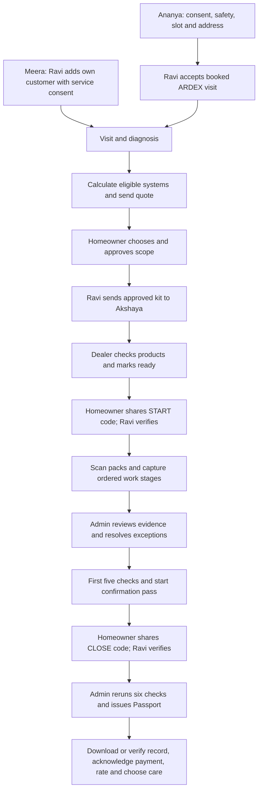

# Application user-flow guide

Reviewed from current source on 2026-10-08. There are **two customer scenarios** and **six account roles**. Each has its own document below. These describe implemented behavior, including who must act next and which prerequisites can block progress.

For an interactive visual version with all guides embedded, open [the HTML user-flow guide](../../public/userflow.html). It works offline and includes customer selection, role filters, expandable steps and printing.

## Customer-specific journeys

| Customer | Entry path | Detailed flow |
| --- | --- | --- |
| Ananya Rao | ARDEX-sourced terrace enquiry, website context, Sakhaa conversation and booked visit | [Ananya — terrace](customer-ananya-terrace.md) |
| Meera Shah | Ravi adds his existing customer using My Lead; bathroom work | [Meera — bathroom](customer-meera-bathroom.md) |

## Role-specific journeys

- [Homeowner](role-homeowner.md)
- [Applicator / Ravi](role-applicator.md)
- [Dealer / Akshaya](role-dealer.md)
- [Admin / operations and technical reviewer](role-admin.md)
- [Super Admin / system owner](role-superadmin.md)
- [Presenter / guided demonstration](role-presenter.md)

## Shared end-to-end handoffs

Normal job status progression is `VISIT_BOOKED → DIAGNOSIS → QUOTE_SENT → APPROVED → KIT_READY → IN_PROGRESS → REVIEW/HANDOVER → COMPLETED`. Review is conditional: it is entered when checks need attention; it is not a separate customer approval. Cancellation produces `CANCELLED` for an eligible open job.

## Six issuance checks

| # | Required check | What must be true |
| --- | --- | --- |
| 1 | Genuine, unused packs | Credited sample-registry packs exist; no unresolved rejected pack or provisional scan |
| 2 | Correct system products | Every approved SKU/unit is represented by credited scans |
| 3 | Coverage quantity | Recorded pack quantities meet each frozen line's tolerance and whole-pack rounding limits |
| 4 | On-site evidence | At least 90% of credited scan/photo locations conservatively fit within 150 m; none exceed 1,000 m or 100 m accuracy |
| 5 | Ordered work and curing | Every required shot is current, correctly timed and manually passed; required in-frame codes confirmed; paired flood/ponding test at least 24 hours with passing outcome; no duplicate images |
| 6 | Homeowner confirmations | START and CLOSE verified, with no active handover hold |

The closing code can be requested after checks 1–5 and START pass. Issuance requires all six. A code alone cannot issue a Passport.

## How to follow one record across roles

Start the demo with `npm run demo`; use the URLs and credentials in [Login details](../LOGIN-DETAILS.md). Presenter can start the guided Ananya journey or load a terrace/bathroom checkpoint. Keep the `?session=...` workspace identifier when switching roles or opening Admin. For simultaneous app roles, use separate browser contexts because app tabs share authentication cookies.

In **Explore connected interfaces**, selecting a Customer journey only changes the selector; Presenter must use **Show journey** to load that scenario/checkpoint. A checkpoint seeds earlier steps rather than replaying them live; the prior workspace run is archived. Ananya's guided presentation is a separate seven-chapter path. Ordinary roles cannot load checkpoints or start the scripted enquiry themselves.

The legacy `HomeownerJourney.tsx` contains a standalone conversation template. The current `Workflow.tsx` renders `LiveConversation`; the guides describe this persisted connected flow, not every button in that unused template.

## Prototype limits that affect every flow

WhatsApp messages stay inside the application. Diagnosis and evidence review are human decisions, with scripted conversation and rule-based calculations. Sample photos, GPS and pack serials are labelled demonstrations. Care preferences do not schedule messages; payments have no provider verification; the issued Water Passport is a demo completion record without an active commercial warranty. Technical prices, systems and curing values need approval for field use.

Offline scan/photo actions can enter a browser outbox. They count only after the service accepts them. **Reconnect & sync** retries them; job/revision conflicts retain pending evidence for review. Reloading retains server records. A fresh presentation/checkpoint uses distinct job identities and keeps earlier history.

Source: [Workflow](../../src/ui/Workflow.tsx), [guided chapters](../../src/ui/GuidedPresentation.tsx), [domain rules](../../src/domain/), [API grants](../../server/index.mjs), [catalog](../../config/catalog.json).
